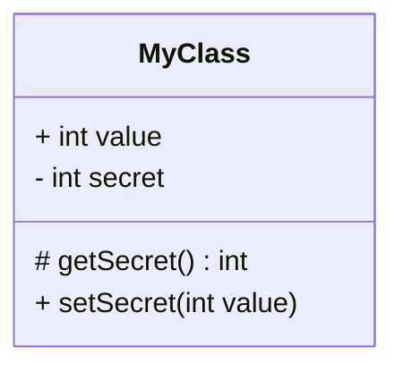
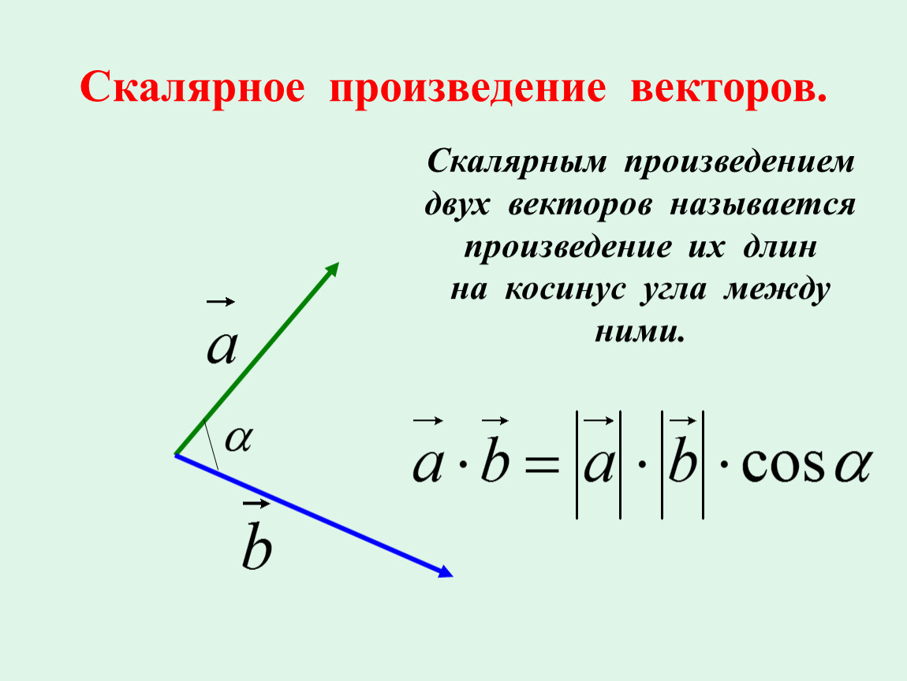
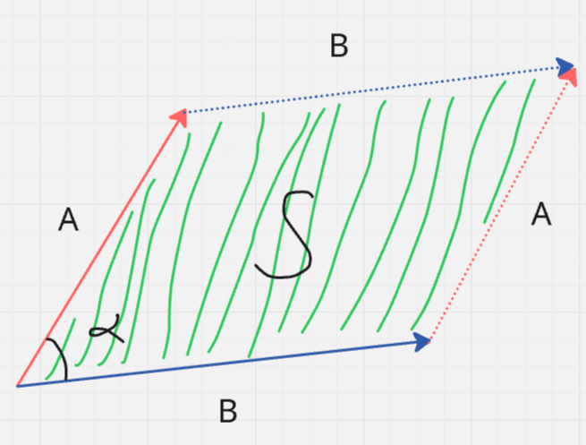
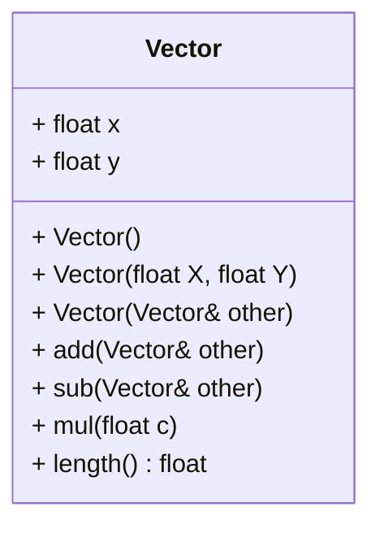
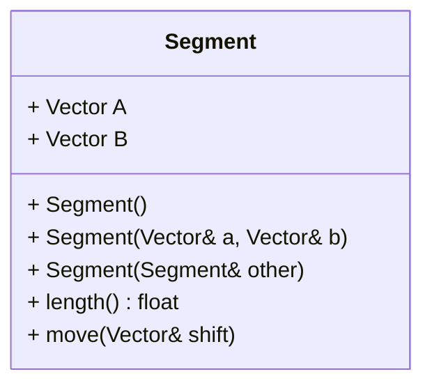
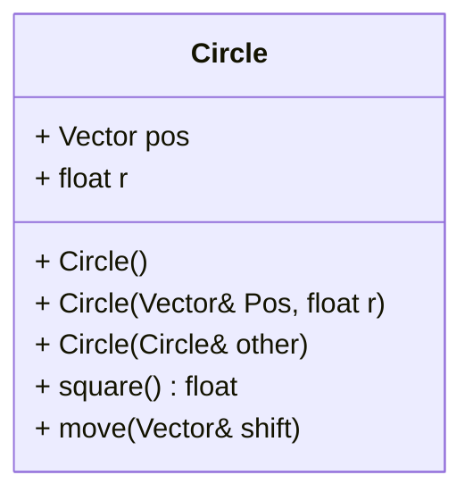
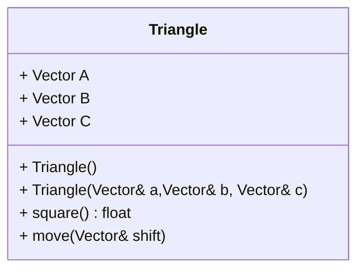

# Библиотека 2 мерной геометрии
## UML диаграммы
Я буду пользоваться UML диаграммой классов.

Каждый класс это прямоугольник разбитый на 3 части.
1) Название класса
2) Переменные класса
    
    Обозначаются так:
    ```
    + float value
    │ │     └ название переменной
    │ └────── тип переменной
    └──────── видимость
    ```

3) Функции класса
   
   Обозначаются так:
    ```
    + func(int value1, int value2) : int
    │ │    │           │              └ возвращаемый тип
    │ │    └───────────┴─────────────── входные данные
    │ └ название функции
    └── видимость
    ```

Видимости бываю такие:
1) **+** это публичная видимость (доступна всем)
2) **-** это приватная видимость (доступна только внутри класса)
3) **#** это защищённая видимость (доступна наследникам и классу)

Пример:


## Класс точки/вектора
### Теория 
Изучить тему векторы и метод координат на [ЯКласс](https://www.yaklass.ru/p/geometria/9-klass?YklShowAll=1)

По сути точка, это вектор, проведенный из начала координат.

Скалярное произведение:

Нам подойдет более простая формула: $a \cdot b = a.x \cdot b.x + a.y \cdot b.y$ 

Векторное произведение:

Векторное произведение это площадь зелённой области: 
$A \times B = S$.

В литературе часто приводят формулу:
$A \times B = |A| \cdot |B| \cdot sin(\alpha)$.

Но нам нужна простая формула:
$A \times B = A.x * B.y - A.y * B.x$.

### Реализация класса

В начале напишем удобный класс вектора, чтобы потом было проще работать с последующими классами.

Схемма класса точки:


Так же написать функции:
```c++
// сумма двух точек
Vector sum(Vector& a, Vector& b);

// разность двух точек
Vector dif(Vector& a, Vector& b);

// умножение точки на число
Vector mul(Vector& a, float s);

// умножение точки на число
Vector mul(float s, Vector& a);

// скалярное произведение
float dotProduct(Vector& a, Vector& b);

// векторное произведение
float crossProduct(Vector& a, Vector& b);
```


## Класс отрезка



Функция move смещает отрезок на данный вектор.


## Класс окружности



Функция square возвращает площадь.

## Класс треугольника


Площадь считать через векторное произведение.