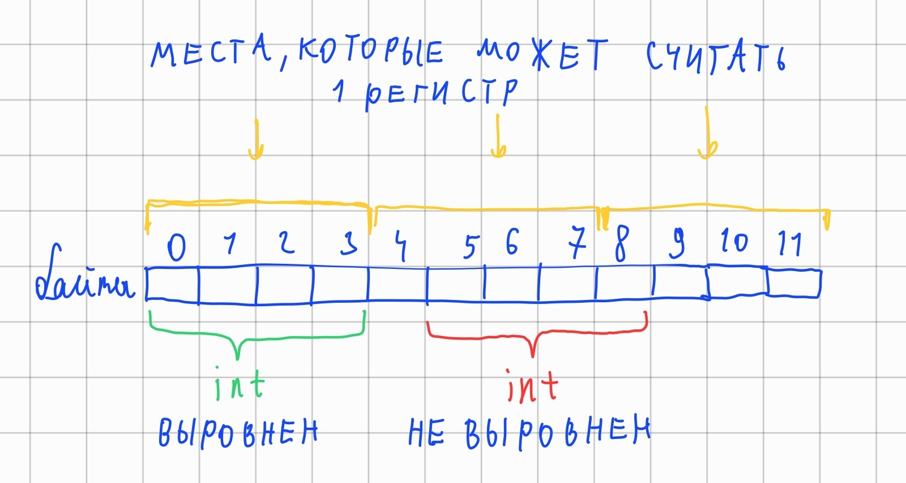

# Alignment

## Как работает
Процессор компьютера не умеет читать данные из любого места.

Например: если мы хотим записать в регистр (это что-то вроде переменной процессора) число A типа int (4 байта), то его адрес должен делиться на 4. 

Когда int лежит по такому адресу, его называют **выровненным**.
Иначе **не выровненным**.

Вот пример на картинке.


**! Замечание:** мы можем читать и невыровненные типы, но тогда у нас будет тратиться не одна команда процессора, а примерно 5.

Поэтому C++ сразу кладёт типы как надо.

Таблица типов с их выравниваниями.
| Тип | Размер | Выравнивание |
|---|---|---|
|int            |4    |4    |
|long long      |8    |8    |
|float          |4    |4    |
|double         |8    |8    |
|long double    |16   |16   |
|char           |1    |1    |
|bool           |1    |1    |
|vector<int>    |24   |8    |
|MyStruct       |24   |8    |

где MyStruct это:
```cpp
struct MyStruct {
  int a;
  char b;
  double c;
  char d;
};
```

Из таблицы видно, что выравнивание равняется максимальному выравниванию из переменных.

Также для своих типов мы можем задать своё выравнивание:
```cpp
struct alignas(8) Point {
  float x, y;
};
```
**! Замечание:** Мы можем только увеличить выравнивание.

Функции:
```cpp
sizeof(/*тип|переменная*/); // возвращает размер
alignof(/*тип|переменная*/); // возвращает выравнивание
```

## Задание

1) У нас есть структура:
    ```cpp
    struct Bad {
      int a;
      long double b;
      bool local_massive_1[3];
      double c;
      float d;
      char local_massive_2[5];
      long long e;
    };
    // alignof(Bad) = 16
    // sizeof(Bad) = 80 
    ```
    Расположи данные так, чтобы размер был минимальным.

2) Придумай универсальное правило, по которому надо упорядочивать данные внутри структуры.