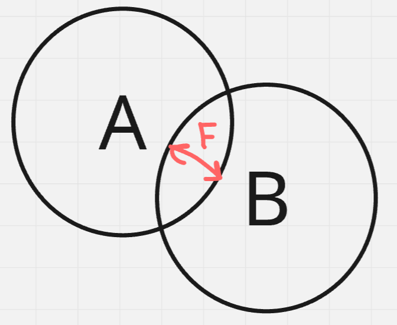
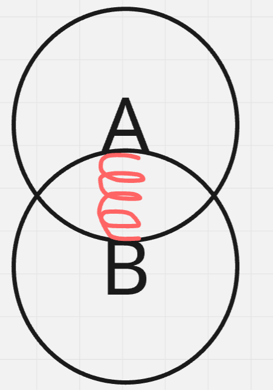
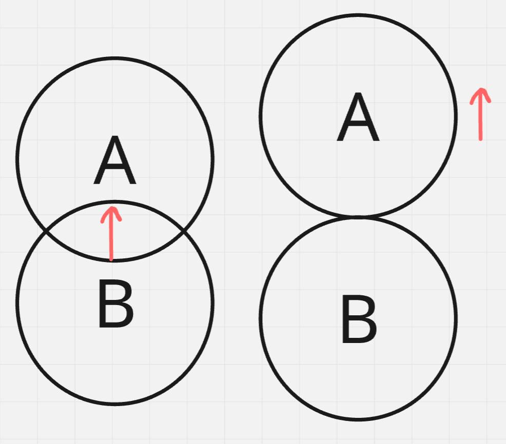
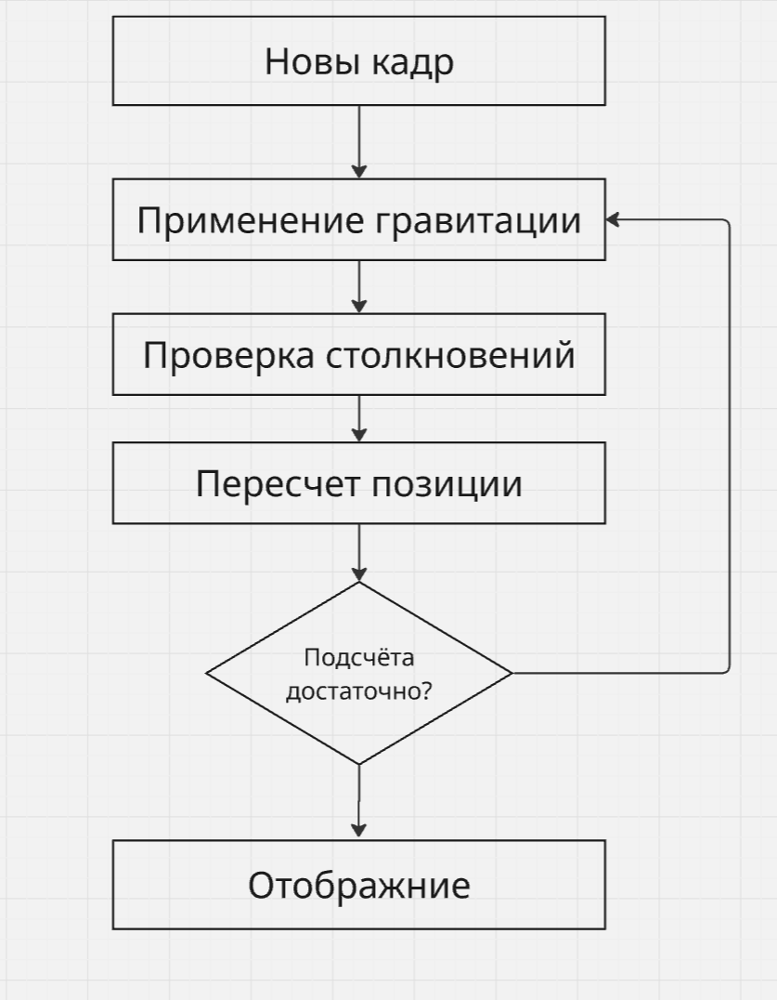

# Физический движёк продолжение

Не забудь удалить force из класса `Body`.

## класс RigitBody

### Теория

Сейчас у нас body не имеет форму.
Но в реальном мире, обычно у всего есть форма.
Поэтому надо добавть форму для тел.

Но с формой добавляются взаимодействия между телами, столкновения.

Вот пример столкновения двух кругов.


Когда два тела входят в друг друга, возникает сила выталкивания.
На рисунке, она обозначена красной стрелочкой.
Она двустороняя, так как на тело A действует сила в одну сторону, а на тело B в другую.

Чем глубже тело A погружено в тело Б, тем большая сила на них действует, аналогично пружине.



А у пружины есть закон Гука:

$$\vec{F} = k * \vec{l}$$

Где $\vec{l}$ это глубина погружения одного тела в другое, $k$ это постоянная (мы её сами задаём).

Но как найти $\vec{l}$?

Для этого нам нужно определить минимальный по длинне вектор, который сдвигает A, так что A перестаёт пересекаться с B.

Вот пример на картинке:


Для кругов это просто. Нужно найти расстояние между их центрами и посмотреть нв сумму их радиусов.


# Реализация

Теперь создадим класс, который будет содержать форму объекта.

Вот структура:
```cpp
struct RigitBody: Body {
  Shape *shape;
};
```

У нас есть форма тела.
Это будет наш абстракный (виртуальный) класс.
```cpp
struct Shape {
  enum Type {
    Circle
  };
  virtual Type type() const = 0;
  virtual Shape() {}
};
```

И так же нам нужна функция, которая определяет вектор выталкивания.

```cpp
Vector getShift(const shape* A, const shape* B) {
  switch(A->type()) {
    case Shape::Circle:
      switch(B->type()) {
        case Shape::Circle:
          {
            Vector ret;
            \* твой код *\
            return ret;
          }
        default: return Vector();
      }
    default: return Vector();
  }
}
```

И тебе нужно будет реализовать:

```cpp
struct Circle: Shape {

}
```

Так же не забывай про `namespace`.
Раздели отдельно физику и геометрию.

Так же каждый класс должен в своем файле.

Внутри самого просчёта физики добавь цикл который сравнивает все пары объектов и проверяет их на пересечение.

Вот схема вычисления:


Земетим, что перепросчёт физики можно в одном кадре выполнять несколько раз.

И ещё добавь пол и стены на границах экрана (как это сделать, придумай сам).


